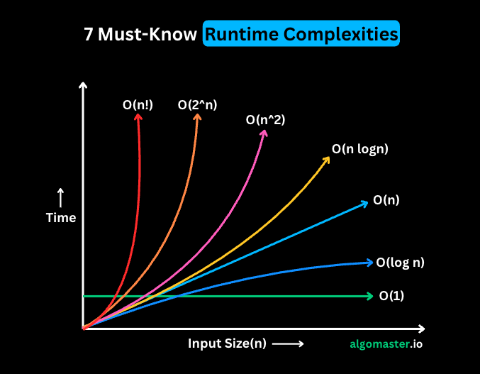

- [learning](#learning)
    - [Accelerating Your OMSCS Preparation Before January 2026](#accelerating-your-omscs-preparation-before-january-2026)
      - [Step 1: Quick Self-Assessment (1 Week)](#step-1-quick-self-assessment-1-week)
      - [Step 2: Complete Foundational Prerequisites (1-2 Months, Self-Paced)](#step-2-complete-foundational-prerequisites-1-2-months-self-paced)
      - [Step 3: Sample OMSCS Courses This Year (1-2 Months, Parallel with Prep)](#step-3-sample-omscs-courses-this-year-1-2-months-parallel-with-prep)
      - [Step 4: Additional Tips for Efficiency and Success](#step-4-additional-tips-for-efficiency-and-success)
- [shortcuts \& prompts: VStudio](#shortcuts--prompts-vstudio)
- [system design](#system-design)
- [lambda](#lambda)
    - [LINQ and Lambda Cheatsheet for C# (Focus on Strings and Arrays)](#linq-and-lambda-cheatsheet-for-c-focus-on-strings-and-arrays)
      - [Where (Filters based on predicate)](#where-filters-based-on-predicate)
      - [Join (Inner join on keys)](#join-inner-join-on-keys)
      - [GroupBy (Groups by key)](#groupby-groups-by-key)
      - [GroupJoin (Left outer join with groups)](#groupjoin-left-outer-join-with-groups)
      - [OrderBy / OrderByDescending / ThenBy (Sorts ascending/descending, multi-level)](#orderby--orderbydescending--thenby-sorts-ascendingdescending-multi-level)
      - [Select (Projects/transforms each element)](#select-projectstransforms-each-element)
      - [SelectMany (Projects and flattens)](#selectmany-projects-and-flattens)
      - [Any / All (Checks existence / universality)](#any--all-checks-existence--universality)
      - [Count (Counts elements matching predicate)](#count-counts-elements-matching-predicate)
      - [Take / Skip (Takes first N / skips first N)](#take--skip-takes-first-n--skips-first-n)
      - [First (Gets first matching or default)](#first-gets-first-matching-or-default)
      - [ToList() / ToArray() (Materializes to collection)](#tolist--toarray-materializes-to-collection)
      - [Aggregate (Reduces with accumulator)](#aggregate-reduces-with-accumulator)
      - [Distinct (Unique elements)](#distinct-unique-elements)
      - [Min / Max / Sum / Average (Computes min/max/sum/avg)](#min--max--sum--average-computes-minmaxsumavg)
      - [Concat / Union / Intersect / Except (Set operations)](#concat--union--intersect--except-set-operations)
      - [Zip (Pairs elements from two sequences)](#zip-pairs-elements-from-two-sequences)
      - [Reverse (Reverses order)](#reverse-reverses-order)
      - [Array-Specific Methods (Non-LINQ; imperative, often mutating)](#array-specific-methods-non-linq-imperative-often-mutating)
    - [Do All Statement Lambda Expressions Return a Boolean, or Is It Only for .Where?](#do-all-statement-lambda-expressions-return-a-boolean-or-is-it-only-for-where)
- [delegate, pub-sub](#delegate-pub-sub)
- [Compound operators e.g. +=](#compound-operators-eg-)

# learning
### Accelerating Your OMSCS Preparation Before January 2026
- **Core Requirements**: Students must complete foundational courses in areas like graduate algorithms, software development processes, and systems/software architecture to build essential CS skills.
- **Computing Systems**: Focuses on topics such as computer networks, database systems, high-performance computing, operating systems, and embedded systems.
- **Interactive Intelligence**: Covers human-computer interaction, artificial intelligence, knowledge-based AI, cognitive modeling, and educational technologies.
- **Machine Learning**: Includes machine learning theory, reinforcement learning, deep learning, data mining, and computational statistics.
- **Computational Perception & Robotics**: Encompasses computer vision, robotics algorithms, computational photography, and geometric computing.
- **Electives and Breadth**: Additional courses in areas like cybersecurity, data science, game development, health informatics, and social computing to provide flexibility and depth.
- **Project/Practicum Options**: Hands-on projects or practicums in specialized areas to apply theoretical knowledge practically.

Congratulations on your OMSCS application—it's an exciting step! Since the program starts in Spring 2026 (January), you have about 5 months (from late July 2025) to complete prerequisites and even sample some OMSCS-level courses. OMSCS doesn't have strict formal prerequisites beyond a bachelor's degree and demonstrated CS capability (via experience or self-study), but success requires proficiency in programming, data structures & algorithms (DS&A), object-oriented principles, and basic math (discrete math, linear algebra for ML tracks). Your resume shows strong practical experience in .NET, C#, Azure, and integrations, which will help, but targeted prep can fill gaps in foundational CS theory.

To finish "prerequisites" ASAP (e.g., core skills) and "do some courses this year," focus on **self-paced, free MOOCs** that align with OMSCS topics. Many OMSCS courses have free audit versions on Udacity, allowing you to experience the content early. Aim for a 3-4 month timeline: Assess skills (1 week), core prep (1-2 months), then sample OMSCS courses (1-2 months). Track progress with weekly goals, and document completions (e.g., certificates) for your portfolio or future references.

#### Step 1: Quick Self-Assessment (1 Week)
- Review OMSCS core requirements: Programming (Python/Java/C++ preferred over just C#), DS&A, OOP, OS basics.
- Test yourself: Use free resources like LeetCode (easy problems) or Codecademy quizzes. If your resume's C# expertise covers OOP/DS&A via projects (e.g., microservices), skip basics; otherwise, prioritize.
- Goal: Identify 2-3 weak areas (e.g., algorithms if your work is more applied dev).

#### Step 2: Complete Foundational Prerequisites (1-2 Months, Self-Paced)
Focus on free MOOCs to build CS fundamentals. Dedicate 10-15 hours/week; most are 4-8 weeks but completable faster.
- **Programming & OOP**: If needing Python (common in OMSCS ML courses):
  - Georgia Tech's "Introduction to Python Programming" (edX, free to audit, ~4 weeks): Covers basics to advanced OOP. Self-paced, start now.
  - Alternative: Google's "Python" course (Coursera, free audit, 25 hours).
- **Data Structures & Algorithms**:
  - Princeton's "Algorithms, Part I & II" (Coursera, free audit, 6-8 weeks each): Excellent for DS&A; highly recommended on r/OMSCS for prep.
  - Georgia Tech's "Introduction to Graduate Algorithms" (Udacity, free, self-paced): Mirrors OMSCS's core algorithms course; ideal if your experience is light on theory.
- **Math Foundations** (if pursuing ML/Perception):
  - Khan Academy's "Linear Algebra" and "Discrete Math" (free, self-paced, 20-30 hours each): Quick refresh; complete in 2-3 weeks.
  - MIT's "Mathematics for Computer Science" (edX, free audit, ~12 weeks but skippable modules).
- **Timeline Tip**: Parallelize—e.g., do Python and Algorithms simultaneously. Aim to finish by October 2025.

#### Step 3: Sample OMSCS Courses This Year (1-2 Months, Parallel with Prep)
Georgia Tech makes many OMSCS courses available for free on Udacity (audit mode, no credit but full content/lectures). This lets you "do courses" now, building momentum and confirming fit. Focus on intro-level ones matching your interests (e.g., ML from your AI goals).
- **Free Udacity OMSCS Audits** (self-paced, start anytime):
  - CS 6200: Introduction to Operating Systems (~10 weeks): Covers systems topics; great if your dev background needs OS depth.
  - CS 6250: Computer Networks (~8 weeks): Aligns with Computing Systems specialization.
  - CS 6476: Computer Vision (~12 weeks): For Perception/Robotics track.
  - CS 6601: Artificial Intelligence (~12 weeks): Broad AI intro; ties to your GE-AIML experience.
  - CS 7641: Machine Learning (~16 weeks but skippable): If ML is your focus; challenging but rewarding.
- **How to Access**: Go to Udacity.com, search for "Georgia Tech OMSCS" courses— they're free to enroll/audit. Complete lectures, quizzes (ungraded), and projects for practice.
- **Why This Year?**: Finish 1-2 by December 2025 (e.g., start OS in September, ML in October). This previews OMSCS rigor without commitment.
- **Alternatives if Paid/Certified**: For credentials, pay ~$99/course on Coursera/edX for similar content (e.g., Stanford's ML on Coursera).

#### Step 4: Additional Tips for Efficiency and Success
- **Pace & Tools**: Use platforms like edX/Udacity for flexibility; track via Notion or Google Sheets. Join r/OMSCS Reddit (free) for study groups—search "prep MOOCs" for community plans.
- **Leverage Your Experience**: Your Azure/ML integrations (e.g., 95% data loss reduction) already demonstrate applicability; use prep to bridge theory gaps.
- **Cost**: All suggested are free to audit; optional certificates ($50-100) if desired.
- **Verification**: Save completion badges/screenshots; mention in future OMSCS updates if relevant.
- **Potential Challenges**: If time-constrained (e.g., work), prioritize 1-2 topics/week. If math-heavy, supplement with YouTube (3Blue1Brown for linear algebra).

This plan lets you enter OMSCS prepared and confident. If you share your weak areas (e.g., algorithms), I can refine further!

# shortcuts & prompts: VStudio
Ctrl+D = copy selected text below

Ctrl+L = delete current line

Answer with a single block of latest .net version C# code. The code should have its own input End the code with a Console.WriteLine("End"); statement. No other ConsoleWriteLine statement is needed because I will test in debug mode with breakpoints. Have minimal comments. Comments should only be at the end of the respective code line.  

# system design
 must-know runtime complexities for coding interviews:

1. 𝐎(1) - 𝐂𝐨𝐧𝐬𝐭𝐚𝐧𝐭 𝐭𝐢𝐦𝐞
- The runtime doesn't change regardless of the input size.
- Example: Accessing an element in an array by its index.

2. 𝐎(𝐥𝐨𝐠 𝐧) - 𝐋𝐨𝐠𝐚𝐫𝐢𝐭𝐡𝐦𝐢𝐜 𝐭𝐢𝐦𝐞
- The runtime grows slowly as the input size increases. Typically seen in algorithms that divide the problem in half with each step.
- Example: Binary search in a sorted array.

3. 𝐎(𝐧) - 𝐋𝐢𝐧𝐞𝐚𝐫 𝐭𝐢𝐦𝐞
- The runtime grows linearly with the input size.
- Example: Finding an element in an array by iterating through each element.

4. 𝐎(𝐧 𝐥𝐨𝐠 𝐧) - 𝐋𝐢𝐧𝐞𝐚𝐫𝐢𝐭𝐡𝐦𝐢𝐜 𝐭𝐢𝐦𝐞
- The runtime grows slightly faster than linear time. It involves a logarithmic number of operations for each element in the input.
- Example: Sorting an array using quick sort or merge sort.

5. 𝐎(𝐧^2) - 𝐐𝐮𝐚𝐝𝐫𝐚𝐭𝐢𝐜 𝐭𝐢𝐦𝐞
- The runtime grows proportionally to the square of the input size.
- Example: Bubble sort algorithm which compares and potentially swaps every pair of elements.

6. 𝐎(2^𝐧) - 𝐄𝐱𝐩𝐨𝐧𝐞𝐧𝐭𝐢𝐚𝐥 𝐭𝐢𝐦𝐞
- The runtime doubles with each addition to the input. These algorithms become impractical for larger input sizes.
- Example: Generating all subsets of a set.

7. 𝐎(𝐧!) - 𝐅𝐚𝐜𝐭𝐨𝐫𝐢𝐚𝐥 𝐭𝐢𝐦𝐞
- Runtime is proportional to the factorial of the input size.
- Example: Generating all permutations of a set.
  

# lambda
### LINQ and Lambda Cheatsheet for C# (Focus on Strings and Arrays)

 - LINQ methods like Where and Select naturally return IEnumerable<T> (lazy execution). If we add .ToList(), it would have immediate execution.
 - Use IOrderedEnumerable<T> for chaining additional sorting levels. Always use this when applyting OrderBy
 - Use IQueryable<T> when querying as DB table
 - Return IDictionary in methods for loose coupling (e.g., IDictionary<string, int> GetScores()—can return a Dictionary inside).
 - Use concrete types like Dictionary<TKey, TValue> when you need fast lookups and don't care about the interface.
    - Dictionary<TKey, TValue>: Default for fast, unordered key-value (implements IDictionary).
    - SortedDictionary<TKey, TValue>: For auto-sorted keys.
    - ReadOnlyDictionary<TKey, TValue>: If data shouldn't change.
    - ConcurrentDictionary<TKey, TValue>: For thread-safe (multi-thread) access.
 - ILookup: When you have groupings with one key to many values
 - IGrouping<TKey, TElement>: Single group from GroupBy (part of ILookup internals). Use for one group at a time.
 - IReadOnlyDictionary<TKey, TValue>: For read-only key-value without modifications.
 - KeyValuePair<TKey, TValue>: For single pairs, not collections.

This cheatsheet covers key LINQ methods using lambda expressions, with a focus on querying strings (as `IEnumerable<char>`) and arrays (e.g., `string[]`, `int[]`). All examples assume `using System.Linq;`. Lambdas are categorized as **Expression Lambdas** (single-line, implicit return) or **Statement Lambdas** (block body with explicit return, for complexity). I've distributed 20 of each across sections, ensuring medium-high complexity, no duplication, and common use cases like filtering with conditions, projections with calculations, handling nulls (C# 8+), regex, and nested queries. Total: 40 lambdas.

I've added missing common LINQ methods to make it exhaustive: Aggregate, Distinct, Min/Max/Sum/Average, Concat/Union/Intersect/Except, Zip, Reverse (LINQ vs. Array). For array-specific ops (non-LINQ), they're grouped under a new "Array-Specific Methods" section at the end.

Examples use placeholders like `strings` (`string[]` or `List<string>`), `nums` (`int[]`), `sentence` (`string`).

#### Where (Filters based on predicate)
- Common: Early in chain for efficiency; returns filtered sequence.
**Expression Lambdas:**
1. `s => s?.Length > 5 && s.IndexOf('a', StringComparison.OrdinalIgnoreCase) >= 0` (filters long strings containing 'a' case-insens).
2. `n => n > 0 && Math.Sqrt(n) % 1 == 0` (filters positive perfect squares).
**Statement Lambdas:**
1. `s => { var vowels = "aeiou"; return s.Count(c => vowels.Contains(char.ToLower(c))) >= 3; }` (filters words with >=3 vowels).
2. `n => { if (n < 0) return false; var sum = 0; for (int i = n; i > 0; i /= 10) sum += i % 10; return sum % 2 == 0; }` (filters non-negative nums with even digit sum, It treats n as its decimal representation without converting to a string. By repeatedly applying modulo 10 (i % 10) to extract the last digit and integer division by 10 (i /= 10) to remove it, the loop "peels off" each digit until i becomes 0).

#### Join (Inner join on keys)
- Common: Combines two sequences on matching keys; result selector combines pairs.
**Expression Lambdas:**
1. `(outer, inner, o => o.ToLower(), i => i.Split('-')[1].ToLower(), (o, i) => $"{o}: {i.ToUpper()}")` (joins on lowercase keys, projects combined uppercase).
**Statement Lambdas:**
1. `(outer, inner, o => o, i => i, (o, i) => { var combined = o + i; return new { Pair = combined, Len = combined.Length * 2; }; })` (joins on equality, projects object with doubled length).

#### GroupBy (Groups by key)
- Common: Partitions into groups; often with projections on groups.
**Expression Lambdas:**
1. `s => s.Length % 2 == 0 ? "Even" : "Odd"` (groups strings by even/odd length).
2. `n => n.ToString()[0]` (<mark>convert to string </mark>& group by first digit as char).
**Statement Lambdas:**
1. `s => { var first = char.ToLower(s[0]); return "aeiou".Contains(first) ? "VowelStart" : "ConsonantStart"; }` (groups by starting vowel/consonant).
2. `(key => key.Length, (k, g) => new { Key = k, Sorted = g.OrderBy(x => x).ToList() })` (groups by length, projects sorted list per group).

#### GroupJoin (Left outer join with groups)
- Common: Joins with grouping for one-to-many; handles non-matches.
**Expression Lambdas:**
1. `(outer, inner, o => o, i => i, (o, ig) => new { Outer = o, InnerCount = ig.Count() })` (groups inners per outer, counts matches).
**Statement Lambdas:**
1. `(outer, inner, o => o.Id, i => i.ParentId, (o, ig) => { var matches = ig.ToList(); return new { Outer = o, FirstMatch = matches.Any() ? matches[0] : null }; })` (joins objects, takes first match or null).

#### OrderBy / OrderByDescending / ThenBy (Sorts ascending/descending, multi-level)
- Common: Sorts; ThenBy for secondary keys.
**Expression Lambdas:**
1. `s => Regex.Replace(s, @"\d+", "")` (OrderBy sorting strings ignoring digits via regex). // strings
2. `n => (n % 10, n)` (ThenBy tuple for last digit then value).
**Statement Lambdas:**
1. `s => { var num = int.TryParse(s, out int val) ? val : 0; return num; }` (OrderByDescending parsing strings to ints, default 0). // strings
2. `n => { return n < 0 ? Math.Abs(n) : n * 2; }` (OrderBy custom: abs for neg, double for pos).

#### Select (Projects/transforms each element)
- Common: Late in chain; changes shape.
**Expression Lambdas:**
1. `s => new { Upper = s.ToUpper(), Hash = s.GetHashCode() % 100 }` (projects to anonymous with upper and mod hash).
2. `n => $"{n:X}"` (projects int to hex string).
**Statement Lambdas:**
1. `s => { var rev = new string(s.Reverse().ToArray()); return rev.Contains('a') ? rev.ToUpper() : rev; }` (reverses, upper if contains 'a').
2. `n => { var factors = Enumerable.Range(1, n).Where(f => n % f == 0); return factors.Sum(); }` (projects to sum of factors).

#### SelectMany (Projects and flattens)
- Common: Flattens nested sequences.
**Expression Lambdas:**
1. `s => s.Split(' ')` (flattens sentence to words). // strings
2. `arr => arr.Where(x => x > 0)` (flattens arrays, filters positives).
**Statement Lambdas:**
1. `s => { var chars = s.ToCharArray(); return chars.Select(c => char.IsLetter(c) ? char.ToUpper(c) : c); }` (flattens word to transformed chars). // strings
2. `arr => { return arr.SelectMany(sub => sub.Concat(new[] { sub.Sum() })); }` (flattens jagged array, appends sum per sub).

#### Any / All (Checks existence / universality)
- Common: Boolean predicates; short-circuits.
**Expression Lambdas:**
1. `s => s?.StartsWith("http", StringComparison.OrdinalIgnoreCase) ?? false` (Any: checks URL-like start). // strings
2. `n => n % 2 == 0 && n > 10` (All: even and >10).
**Statement Lambdas:**
1. `s => { var trimmed = s.Trim(); return trimmed.Length > 0 && char.IsDigit(trimmed[0]); }` (Any: non-empty trimmed starting with digit). // strings
2. `n => { var abs = Math.Abs(n); return abs.ToString().All(c => c == '1' || c == '0'); }` (All: binary-like digits in abs).

#### Count (Counts elements matching predicate)
- Common: With or without condition.
**Expression Lambdas:**
1. `s => Regex.IsMatch(s, @"^[a-z]+$")` (counts lowercase-only words). // strings
**Statement Lambdas:**
1. `n => { var prime = n > 1 && !Enumerable.Range(2, (int)Math.Sqrt(n)).Any(d => n % d == 0); return prime; }` (counts primes).

#### Take / Skip (Takes first N / skips first N)
- Common: Pagination; dynamic N possible.
**Expression Lambdas:**
1. `() => strings.Count() / 2` (Take dynamic half count; no lambda param needed, but for consistency).
**Statement Lambdas:**
1. `() => { var total = nums.Length; return total > 10 ? 5 : total; }` (Skip computed based on length).

#### First (Gets first matching or default)
- Common: With predicate; throws if none.
**Expression Lambdas:**
1. `s => s.Contains("error", StringComparison.OrdinalIgnoreCase)` (First error-containing string). // strings
**Statement Lambdas:**
1. `n => { return n.ToString().Reverse().SequenceEqual(n.ToString()); }` (First palindrome num as string).

#### ToList() / ToArray() (Materializes to collection)
- Common: Forces execution; no lambda, but often after lambdas.
(No lambdas here, as these are parameterless; included for completeness.)

#### Aggregate (Reduces with accumulator)
- Common: Custom reductions like sum, concat.
**Expression Lambdas:**
1. `(acc, s) => acc + (s.Length > acc.Length ? s : "")` (aggregates longest string). // strings
2. `(acc, n) => acc * n / gcd(acc, n)` (aggregates LCM via GCD; assume gcd func).
**Statement Lambdas:**
1. `(acc, s) => { return string.IsNullOrEmpty(acc) ? s : acc + ", " + s.Substring(0, Math.Min(3, s.Length)); }` (aggregates with truncated comma-sep). // strings
2. `(acc, n) => { var next = acc + n; return next > 100 ? next % 100 : next; }` (aggregates sum with mod overflow).

#### Distinct (Unique elements)
- Common: Removes duplicates; custom comparer possible.
**Expression Lambdas:**
1. `s => s.ToLower()` (distinct case-insens via projection first, then Distinct). // strings
**Statement Lambdas:**
1. `n => { return Math.Abs(n) % 10; }` (distinct by last digit abs).

#### Min / Max / Sum / Average (Computes min/max/sum/avg)
- Common: With selector for custom.
**Expression Lambdas:**
1. `s => s.Count(c => char.IsDigit(c))` (Min by digit count). // strings
2. `n => n * n` (Max of squares).
**Statement Lambdas:**
1. `s => { return double.Parse(s.Replace("k", "000")); }` (Average parsing with 'k' suffix). // strings
2. `n => { return n < 0 ? 0 : n; }` (Sum ignoring negatives).

#### Concat / Union / Intersect / Except (Set operations)
- Common: Combines sequences; Union/Intersect/Except remove dups.
**Expression Lambdas:**
1. `s => s.Substring(1)` (Concat after trimming first char). // strings
**Statement Lambdas:**
1. `n => { return n % 3 == 0 ? n : 0; }` (Intersect after mod filter).

#### Zip (Pairs elements from two sequences)
- Common: Combines pairwise.
**Expression Lambdas:**
1. `(s1, s2) => s1 + s2.Length` (zips strings with length append). // strings
**Statement Lambdas:**
1. `(n1, n2) => { return Math.Min(n1, n2) + Math.Max(n1, n2); }` (zips to min + max).

#### Reverse (Reverses order)
- Common: LINQ version returns new; non-mutating.
**Expression Lambdas:**
1. `() => strings.Reverse()` (simple reverse; no param).
**Statement Lambdas:**
1. `() => { return nums.Reverse().Select(n => -n); }` (reverse then negate).

#### Array-Specific Methods (Non-LINQ; imperative, often mutating)
- Common: For arrays only; contrast with LINQ.
**Expression Lambdas:**
1. `n => n % 2 == 0` (predicate for Array.Find).
2. `s => s.Length` (comparison for Array.Sort by length). // strings
**Statement Lambdas:**
1. `(a, b) => { return a.ToString().CompareTo(b.ToString()); }` (comparer for Array.Sort nums as strings).
2. `c => { return char.IsUpper(c); }` (predicate for Array.Find on char array). // strings (char arrays)

### Do All Statement Lambda Expressions Return a Boolean, or Is It Only for .Where?

No, statement lambda expressions do not always return a boolean—they can return any type, depending on the context and the delegate signature they're assigned to. The return type is determined by the method or interface the lambda is used with (e.g., in LINQ, event handlers, or custom funcs). Statement lambdas (using `{ }` with explicit `return`) are just a syntactic form for more complex logic; the return value matches what's expected.

- **Why It Seems Boolean-Only**: In filtering methods like `.Where` (which expects `Func<T, bool>`), the lambda must return `bool` (true/false for keep/discard). But this is specific to `.Where`'s signature, not a rule for all statement lambdas.

- **General Rules for Lambda Return Types**:
  - Lambdas (expression or statement) infer their return type from the delegate they're bound to (e.g., `Func<T, TResult>`).
  - Expression lambdas (e.g., `n => n > 5`) are single-line with implicit return.
  - Statement lambdas (e.g., `n => { /* code */; return value; }`) allow multi-line logic, loops, conditionals, but still return what the delegate requires.
  - If no return is needed (e.g., `Action<T>`), use `void` implicitly or with no `return value;`.
  - Compilation Error: If the return doesn't match (e.g., returning `int` where `bool` is expected), it fails.

- **Examples Across LINQ Methods (Showing Variety)**:
  - **Boolean Return (e.g., .Where, .Any, .All)**: `s => { var count = s.Count(c => char.IsVowel(c)); return count % 2 == 0; }` (returns `bool` for even vowel count).
  - **Any Type Return (e.g., .Select – Projects to Custom Type)**: `s => { var rev = new string(s.Reverse().ToArray()); return new { Reversed = rev, Length = s.Length }; }` (returns anonymous object).
  - **Numeric Return (e.g., .Sum with selector)**: `n => { if (n < 0) return 0; var squared = n * n; return squared > 100 ? squared / 2 : squared; }` (returns `int` after computation).
  - **String Return (e.g., .Select)**: `n => { var hex = n.ToString("X"); return hex.Length > 2 ? hex.Substring(0, 2) : hex; }` (returns formatted string).
  - **Collection Return (e.g., .SelectMany)**: `arr => { var filtered = arr.Where(x => x > 0); return filtered.Select(x => x * 2); }` (returns `IEnumerable<int>`).
  - **Void (No Return, e.g., .ForEach or Action)**: `s => { Console.WriteLine(s); /* no return */ }` (performs side-effect, implicit void).

- **Non-LINQ Examples**:
  - Threading: `() => { Thread.Sleep(1000); return "Done"; }` (returns `string` for Task<string>).
  - Events: `sender => { Log("Clicked"); }` (void for event handlers).

In summary, the return type is context-driven, not fixed to boolean—only .Where (and similar predicates) enforce `bool`. Use statement lambdas for complex logic regardless of type.
# delegate, pub-sub
**Delegate:** A delegate is like a contract that defines a method’s signature (parameters and return type). It acts as a pointer to methods that match this signature, allowing them to be called indirectly.

A method signature is `public int Calculator(int x, int y);`
A delegate would be  `public delegate int Calculator(int x, int y);`

**Event:** In C#, an event is a special kind of delegate that supports the publisher-subscriber pattern. It allows multiple methods to be "subscribed" to it, and when the event is "raised" by the publisher, all subscribed methods are called.

**Subscription (+=):** This adds a method to the event’s list of handlers. It’s like signing up for a newsletter—your method gets added to the list of recipients.

**Invocation:** When the publisher raises the event (using Invoke), all subscribed methods are called with the specified arguments.

# Compound operators e.g. +=
| Operator | Description | Example (equivalent long form) |
|----------|-------------|--------------------------------|
| `/=`     | Division assignment | `x /= y;` (`x = x / y;`) |
| `%=`     | Modulus assignment | `x %= y;` (`x = x % y;`) |
| `&=`     | Bitwise AND assignment | `x &= y;` (`x = x & y;`) |
| `\|=`    | Bitwise OR assignment | `x \|= y;` (`x = x \| y;`) |
| `^=`     | Bitwise XOR assignment | `x ^= y;` (`x = x ^ y;`) |
| `??=`    | Null-coalescing assignment (C# 8+) | `x ??= y;` (`x = x ?? y;`) Sets `x` to `y` only if `x` is null. |
